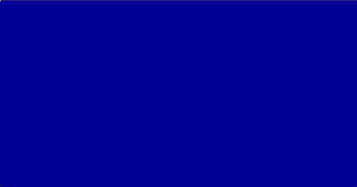

## Portfolio 

Here's a project designed to introduce myself in a fun way.

Here you can find out about my training and professional experience.  Thank you for taking the time to read it, and please don't hesitate to contact me. 


## Stack

- Next.js 14
- React 18
- React DOM 18
- GSAP 
- @gsap/react
- next-intl 
- react-icons 
- split-type 
- styled-components 
- validator

# Run with

```bash
npm run dev
# or
yarn dev
# or
pnpm dev
# or
bun dev
```

